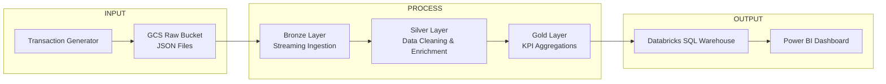
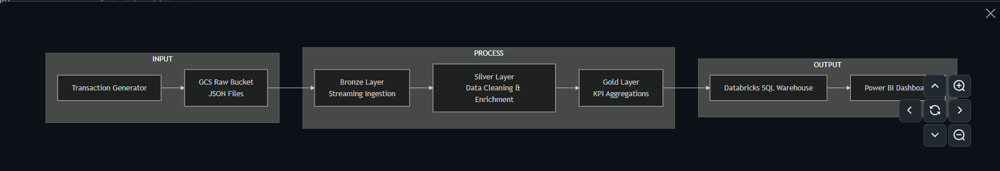
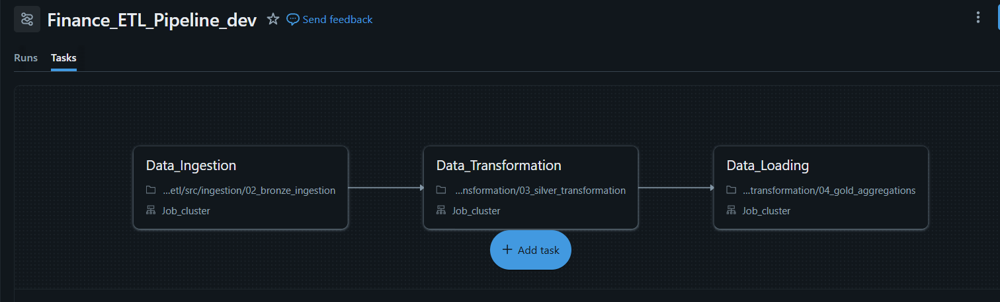
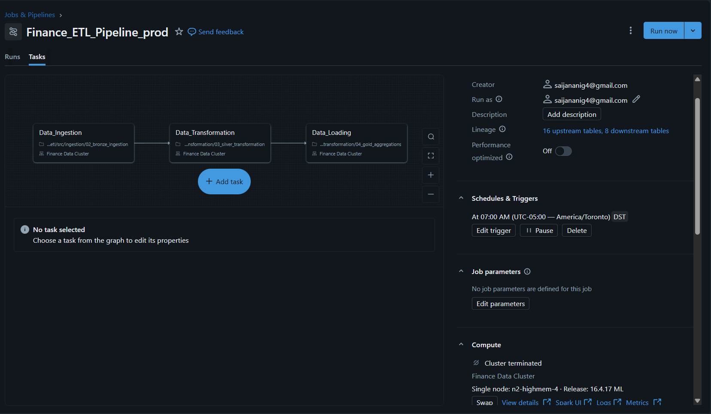
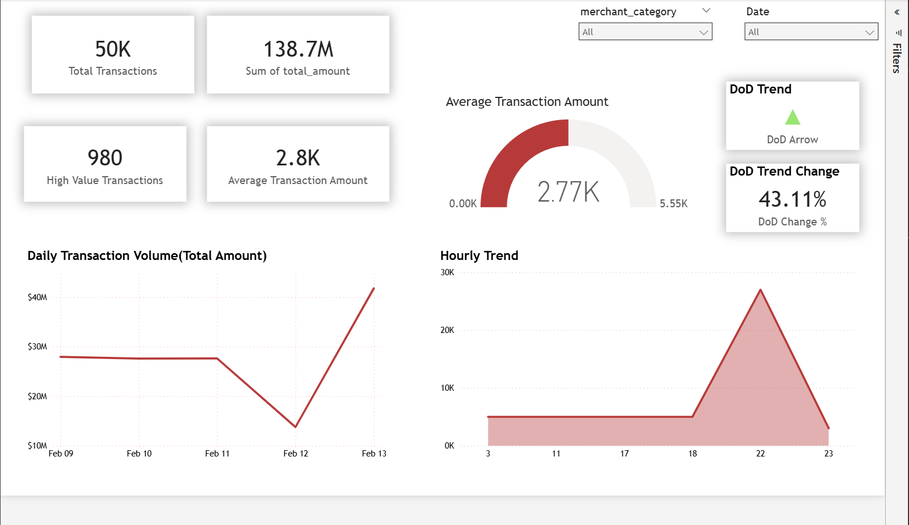
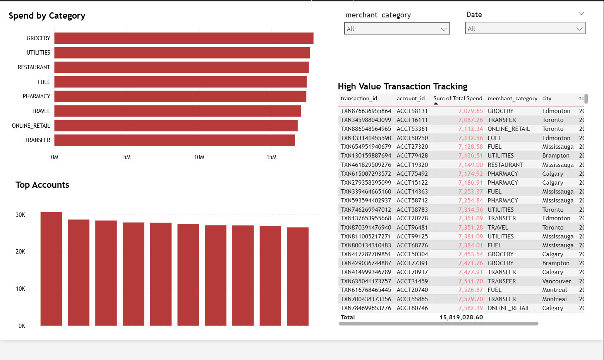

# Real-Time Banking ETL (Databricks on GCP) + Power BI

## Overview
Built a cloud-native **financial transaction lakehouse** using **Databricks on GCP**, implementing **Medallion Architecture (Bronze → Silver → Gold)** with streaming ingestion and analytics-ready KPIs served to **Power BI** via **Databricks SQL Warehouse**.

This project is designed to showcase both **Data Engineering** (ETL, orchestration, streaming, governance) and **Data Analytics** (data modeling, DAX, dashboards, business KPIs).

---
## Key Skills Demonstrated

- Cloud ETL pipeline design (Databricks on GCP)
- Streaming ingestion using Auto Loader
- Medallion Architecture implementation
- Workflow orchestration (Dev & Prod environments)
- Star schema data modeling
- SQL Warehouse serving layer
- Power BI dashboard development

---
## I/O Architecture Diagram




**Pipeline flow:**
1. Synthetic transaction generator writes JSON batches to GCS (Raw).
2. Databricks Auto Loader ingests into **Bronze** (streaming + checkpointing).
3. **Silver** cleans and enriches data (dates, hour, weekday, high-value flag).
4. **Gold** builds business KPIs (daily/hourly/category/top accounts/high-value table).
5. Databricks SQL Warehouse serves curated Gold tables to Power BI.

---

## Tech Stack
- **GCP:** Google Cloud Storage (Raw/Processed zones)
- **Databricks (GCP):** Spark, Auto Loader, Workflows, Unity Catalog
- **Delta Lake:** Bronze/Silver/Gold storage
- **Databricks SQL Warehouse:** serving layer
- **Power BI:** dashboard + DAX time intelligence

---

## Repo Structure
```text
real-time-banking-etl/
├── src/
│   ├── config/
│   │   └── 00_config_and_helpers.ipynb
│   ├── ingestion/
│   │   ├── 01_transaction_generator.ipynb
│   │   └── 02_bronze_ingestion.ipynb
│   └── transformation/
│       ├── 03_silver_transformation.ipynb
│       └── 04_gold_aggregations.ipynb
├── orchestration/
│   ├── workflows.md
│   └── runbook.md
├── architecture/
│   └── lakehouse_architecture.png
├── images/
│   ├── dashboard_executive.png
│   ├── dashboard_insights.png
│   ├── job_dev_graph.png
│   └── job_prod_schedule.png
└── README.md
```

---

## Data Layers(Medallion)
**Bronze(Streaming Ingestion)**
- Auto Loader reads JSON files from GCS incoming/
- Checkpointing ensures files are processed once
- Writes Delta to processed bucket (Bronze path)
 
**Silver(Clean + Enrich)**
- Validations (e.g., positive amounts)
- Derived fields:
  - transaction_date
  - hour_of_day
  - day_of_week
  - is_high_value

**Gold(KPI Aggregations)**
Creates analytics-ready tables:
- gold_daily_kpis
- gold_hourly_kpis
- gold_category_kpis
- gold_top_accounts_daily
- gold_high_value_txns
- gold_top_account_by_category_daily

## Data Modeling (Power BI)
- **Star schema** with a shared DateTable dimension and Merchant Category dimension
- Measures include:
  - Total Transactions
  - Total Spend
  - High Value Transaction Count
  - DoD % Change (time intelligence)
      

## Orchestration (Dev vs Prod)
- Parameterized environment configuration (env=dev or env=prod)
- Databricks Workflows:
  - Dev: fast iteration

  - Prod: scheduled daily run (07:00)

- Details: see orchestration/workflows.md

## Dashboard (Power BI)
## Executive Overview

## Spend & Risk Insights


## How to run(High Level)
**1. Generate Raw Data(optionl)**
- Run (src/ingestion/01_transaction_generator)
**2. Run the Pipeline**
- Run in the following order:
  - 02_bronze_ingestion
  - 03_silver_transformation
  - 04_gold_aggregations
- Or trigger via Databricks Workflows(Recommended)

## Result(Example)
- Bronze/Silver row counts: 35,000
- Gold daily KPI rows: based on distinct transaction dates
